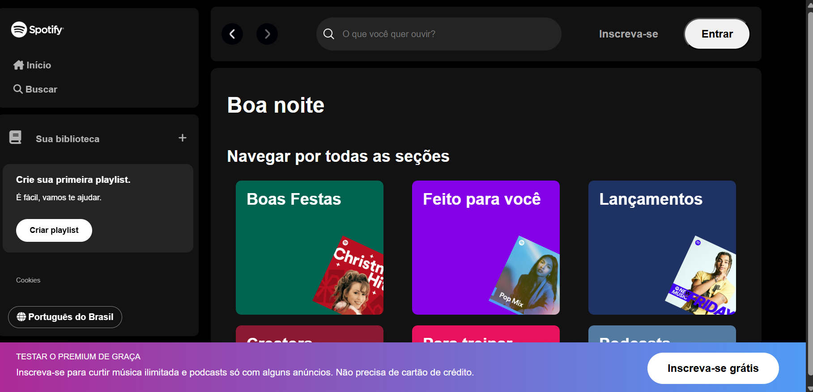

# spotify-alura
## Sobre o Projeto
Este projeto foi desenvolvido através da imersão da Alura e faz parte dos meus estudos de front-end.
A aplcação simula uma interface inspirada no Spotify, utilizando:
-HTML
-CSS
-JavaScript

## Preview 

